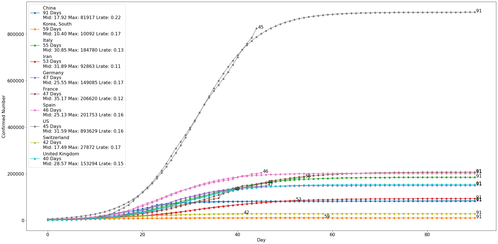

# Experimental COVID-19 Prediction US

## Data processing
The original data is `time_series_covid19_confirmed_global.csv` from CSSEGISandData. 
The data contains `Province/State` field, and this field is compressed into `Country/Region`. 
Then, the countries of the top 10 number of confirmed cases are selected and transposed as `main DataFrame`.  
  
The dates of top 10 countries who reached first 500 or more cases are obtained as `From 500 Day`. 
Then, the time series of each country are normalized by the method below.  
Notice that China and Korea's Data is just used `Row ← Row/MaxOfCurrData` to normalize since the curves of China and Korea are long enough to reach a reasonable maximum value (not needed to estimate).

* Normalization Method 1  
`Ratio`  
`= MaxNumberOfCurrData/China'sData[CurrentDay-500Day]`  
`= MaxNumberOfCurrData/China'sData[DiffDaysFrom500OfCurrData]`  
`= MaxNumberOfCurrData/China'sNumberWithDiff`  
`EstimatedMaxOfCurrData = Ratio*China'sMax`  
`Row ← Row/EstimatedMaxOfCurrData`  

* Normalization Method 2  
`EstimatedMaxOfCurrData = MaxOfLogisticFunc(From Logistic Method)`  
`Row ← Row/EstimatedMaxOfCurrData`  

## Model Training
The model is trained by using China's Data, and the validation data is Korea's Data. Repeatly train `70` epochs, and get `- loss: 9.1215e-04 - val_loss: 0.1536`. 

## Result Analysis
Use the model to evaluate the time series of each country. In each iteration, move the time series to left, and test the `Best Fit Day`. Move the curve (time series) of each country to the best position, and draw the figure below. 
  
Assuming that each country's time series obey the same pattern as China's Data, the slowing down date of the US can be predicted. The Day is `Stage Day`.  
  
### Normalization Method 1 (total MSE=0.016026, Iran excepted)  
  
  
3/28: The actual increasing speed is slightly slower than the curve predicted at 3/26.  
4/5: The actual increasing speed is 1 day later than the curve predicted at 3/28.   
  
### Normalization Method 2 (total MSE=0.009515, Iran excepted)  
  
  
4/5: The actual increasing speed is 4 day later than the curve predicted at 3/28, which means the increasing speed is significantly lower than before, and the social distancing is working.  

By 3/28, the slowing down date of the US is about 4/15.  
By 4/5, the slowing down date of the US is about 4/18.   
  
## Logistic Method  
Use `curve_fit(logistic_func, x, y)` to fit each country's time series. The Day is `From 500 Day`.  
`Mid`: sigmoid's midpoint  
`Max`: curve's maximum value  
`Lrate`: logistic growth rate  
  
Assuming that each country's time series obey the logistic function (fitted by itself), the 
future curve can be predicted.
  
  
  
3/28: The logistic rate is slightly lower, and need more time to reach the maximum value.   
4/5: The logistic curve looks like predicting very well (8 days past from 3/28). The logistic rate become reasonable compared to other countries. However, due to the initial speed is too high, the final cases might reach 50,0000+.  
  
By 3/28, the slowing down date of the US is about 4/11.  
By 4/5, the slowing down date of the US is about 4/18.  
  
## Reference and Acknowledgment  
CSSEGISandData, https://systems.jhu.edu/, https://github.com/CSSEGISandData/COVID-19/tree/master/csse_covid_19_data
  
## Disclaimer  
All information, content, and material of this project is for informational and academic purposes only and are not intended to serve as a substitute for the consultation, diagnosis, and/or medical treatment of a qualified physician or healthcare provider.
